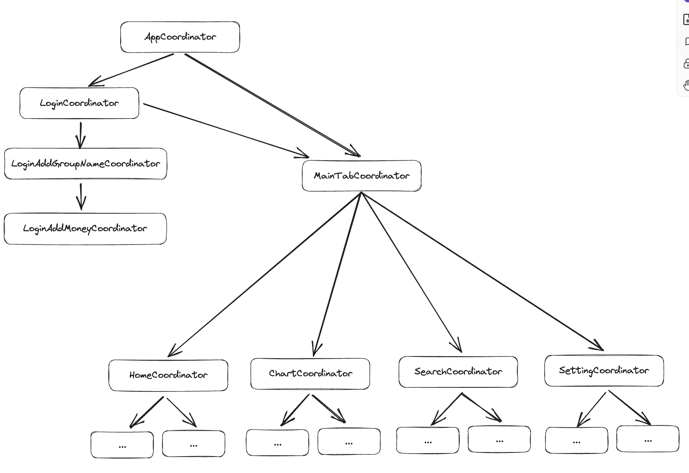
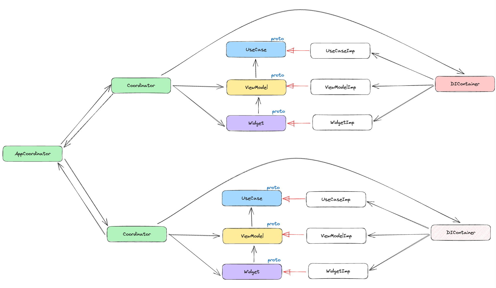
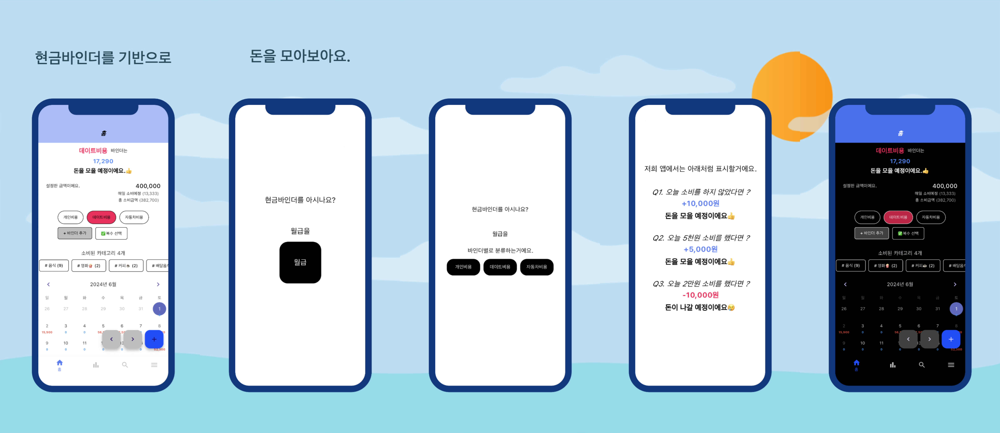

# Table
[Goal](#Goal)

[Architecture](#Architecture)
- [Component](#컴포넌트)
- [Unit](#단위)
- [Coordinator](#Coordinator)
- [Diagram](#Diagram)
- [DataBase](#DataBase)
- [BuildConfiguration](#BuildConfiguration)

[ScreenShot](#ScreenShot)

[AppStore](#AppStore)

[Blog](#Blog)

# Goal 
1. **Flutter** 로 개발하여 안드로이드, iOS 개발 및 배포 경험
2. 로버튼 C 마틴의 **클린아키텍쳐** 기반으로 구현
3. 내가 사용하기 위한 **가계부** 구현

# Architecture

## 컴포넌트 
` Entity `
- 앱의 핵심 모델 

` UseCase `
- 시스템 의도

` Coordinator `
- 뷰전환 담당, View, ViewModel에 의존한다. 
- View를 관리하긴하나, View의 세부사항은 모르도록 한다. 
- View의 업데이트를 하기위해서는 ViewModel에 의존하도록 한다. 

` View `
- 뷰 담당 (Widget)
- View는 오직 ViewModel만 의존하도록 한다. 

` ViewModel `
- View에 필요한 데이터 및 로직 담당
- View를 모르도록 하고, UseCase에 의존한다. 

` DIContainer `
- 의존성 주입
- UseCase의 구현체를 주입해주는 역할.  
- ViewModel 주입
- View 주입 

## 단위
하나의 화면(1개이상의 Widget) 은 `Coordinator, View, ViewModel `을 구현해야한다. 

Coordinator가 View를 관리하고, View는 ViewModel을 필요로한다. 

필요에따라서 UseCase를 구현하고, DIContainer에서 주입받을수있도록 추가한다.

## Coordinator 
화면관리를 Coordinator가 관리를 하고, 트리구조로 구현.

자식 Coordinator에 있는 View의 액션으로 부모의 다른 Coordinator의 View를 업데이트하려면 부모로 전달하여 업데이트하는식으로 구현.

## Diagram 

## DataBase
SQLite

## BuildConfiguration
` flavor ` 
- mock, cbt, real  3개로 구분 
- 이 3개의 환경에 따라 UseCase를 다르게 넣어주거나, 광고id를 다르게 넣거나 

# ScreenShot 

# AppStore
[앱스토어링크](https://apps.apple.com/kr/app/%EB%A8%B8%EB%8B%88%EC%B1%8C%EB%A6%B0%EC%A7%80/id6504971575)

# Blog 
[앱 배포 후기..](https://vapor3965.tistory.com/118)
